<p align="center">
  
  
  
  
  
</p>

<p align="center">
<a href="https://www.buymeacoffee.com/adi1090x"></a>
<a href="https://ko-fi.com/adi1090x"></a>
</p>

<p align="center">
Second version of my custom ISO based on <a href="https://www.archlinux.org">Arch Linux</a>, made with <b>Archiso</b>... (for newbies and DIY enthusiasts)
</p>

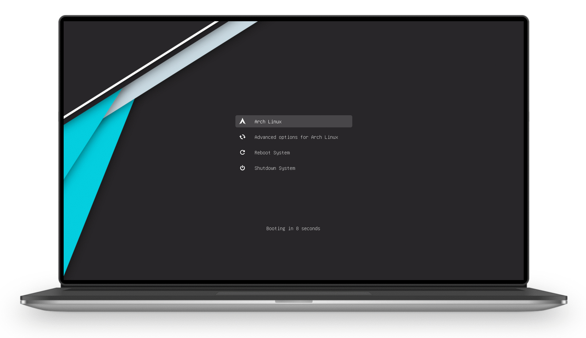 <br />

## Project Moved

<a href="https://archcraft-os.github.io"></a>

This project just got bigger. It now became a Linux Distribution.

> A Minimalistic Linux Distribution, Focused On Aesthetics & Based On Arch Linux.

+ **Official Website** : [Visit Here](https://archcraft-os.github.io/)
+ **Project Page** : [Archcraft](https://github.com/archcraft-os/archcraft)
+ **Download** : [Sourceforge](https://sourceforge.net/projects/archcraft/files/latest/download)

##

## Features

+ Offline Installer - [Installation Guide Here](https://github.com/adi1090x/archlinux/blob/master/images/Installer/README.md)
+ Enabled `Encryption` Settings By Default
+ Grub - With `Vimix theme` - Configured
+ Plymouth - `Miniloop Theme` - Configured
+ Xorg Server / GUI - `Intel Video Drivers`
+ Lxdm Display Manager - With `Custom themes`
+ **Openbox** & **Bspwm** Window Managers - Fully Configured
+ Global `Dark` & `Light` Modes in `Openbox`
+ Xresources based theming in `Bspwm`
+ Custom `Gtk` And `Icon` Themes
+ Network Manager - With `networkmanager_dmenu`
+ File Manager - `Thunar` with full Functionality (Partition Mounting, Network Access, Thumbnails Etc)
+ Compositor - `picom`
+ Notifications - `dunst`
+ Status - `polybar` 
+ Menus, Applets, Dialogs - `Rofi`
+ AUR helper - `yay`
+ Shell (zsh with `omz`), Vim, Ranger, etc - Configured
+ And a lot...

## How To Get ISO

**1. Download -** You can either download already generated ISO file, or...
<p align="center">
  <a href="https://mega.nz/folder/6swHxAYS#v_Ymd5ZQ3EkS9RhuQVAaJQ" target="_blank"></a>
</p>
  
**2. Build ISO -** If you're already using archlinux & want to build the iso, maybe with modified config then...

***Check list***
- [ ] At least 10GB of free space
- [ ] Arch Linux 64-bit only
- [ ] Clear pacman cache; ```sudo pacman -Scc```
- [ ] Configure everything as *root*
- [ ] Disable auto updates

+ Open the terminal & clone this `branch` of repository 
```bash
git clone --single-branch --branch version-2.0 --depth=1 https://github.com/adi1090x/archlinux.git archlinux
```

+ After cloning, run *'setup.sh'*, it'll install the dependencies, AUR packages, Fix Permissions, Etc. Be Patient!
```bash
cd archlinux
chmod +x setup.sh
./setup.sh
```

+ Now, Change to *'iso'* directory & get ***ROOT*** & Run *'build.sh'*
```bash
cd iso
sudo su
./build.sh -v
```

+ If everything goes well, you'll have the ISO in *'iso/out'* directory. <br />

> If you want to Rebuild the ISO, remove **work** & **out** dirs inside **iso** directory first. Then run `./build.sh -v` as *root*. You don't need to run **setup.sh** again, it's a one time process only. 

## Boot The ISO

**1. Using GRUB -** If you're already using a linux distro, with grub, then you can add following entry in your `grub.cfg` file, Replace **X** with your partition number, and `path_to_your_iso` with ISO path, which can be *(/home/USERNAME/archlinux/iso/out/CustomArch-xxxx.xx.xx-x86_64.iso)* <br />
```
menuentry 'Custom Arch Linux Live' --class arch --class gnu-linux --class linux {
    set root='(hd0,X)'
    set isofile="path_to_your_iso"
    set dri="free"
    search --no-floppy -f --set=root $isofile
    probe -u $root --set=abc
    set pqr="/dev/disk/by-uuid/$abc"
    loopback loop $isofile
    linux  (loop)/arch/boot/x86_64/vmlinuz img_dev=$pqr img_loop=$isofile driver=$dri quiet loglevel=3 systemd.show_status=false udev.log-priority=3 vt.global_cursor_default=0 splash cow_spacesize=1G
    initrd  (loop)/arch/boot/intel_ucode.img (loop)/arch/boot/x86_64/archiso.img
}

```
<br />

**2. Using dd -** Alternatively, you can use ***dd*** command to make a bootable USB_Drive/SDcard, Just open the terminal and... <br />
```bash
sudo su
dd bs=4M if=path_to_iso of=/dev/sdX status=progress oflag=sync
```
<br />

**3. Using Etcher -** If you use *Windows*, or maybe linux but afraid of ***dd***, then you can use [Etcher](https://www.balena.io/etcher/) to make a bootable USB/SDcard. More Options [Here](https://wiki.archlinux.org/index.php/USB_flash_installation_media)
<br />

## What's New

+ ***New Look and Style***

`Openbox`

Desktop|Modes
:--:|:--:
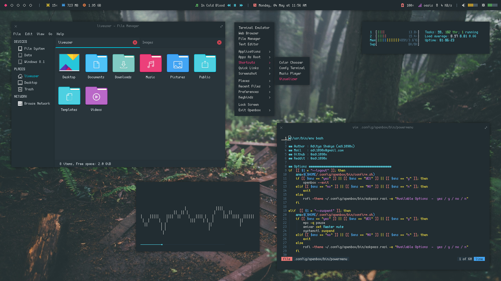|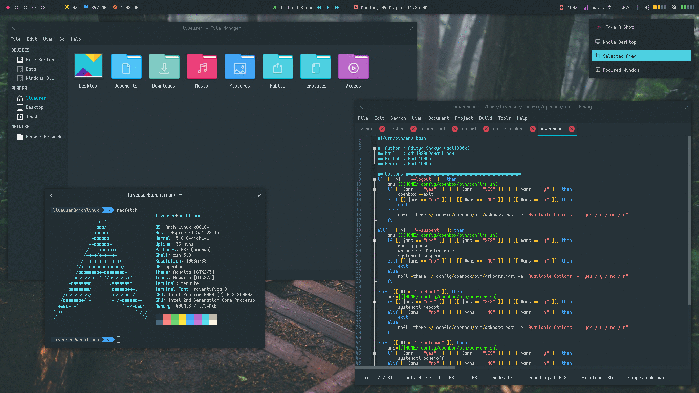

`Bspwm`

Desktop|Styles
:--:|:--:
|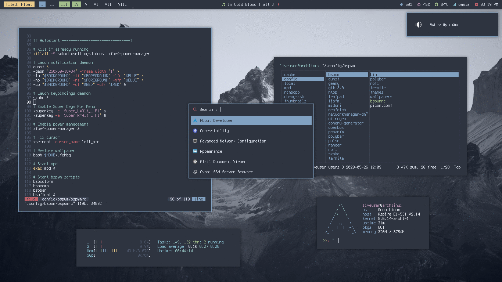

+ ***Rofi based custom applets & Menus***

`Openbox`

|Network|MPD|System|Internet|Screenshot|
|--|--|--|--|--|
|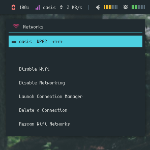|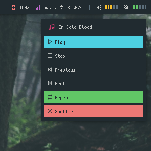|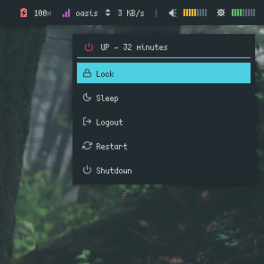|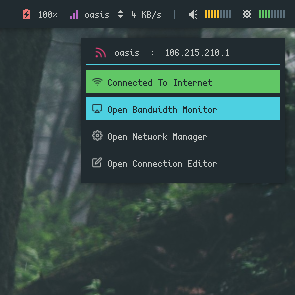|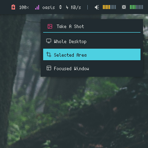|

`Bspwm`

|Launcher|Windows|Network|As Root|Themes|
|--|--|--|--|--|
|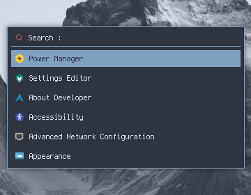|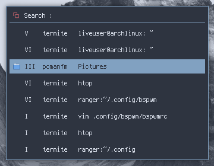|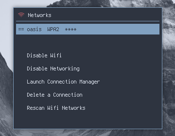|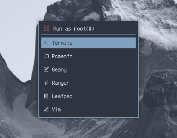|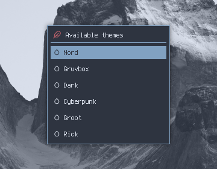|

|MPD|Power Menu|Internet|Screenshot|
|--|--|--|--|
|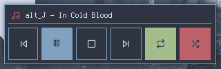|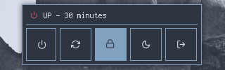|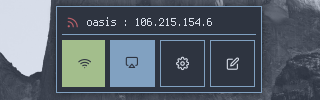|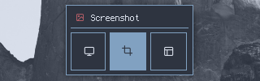|

+ ***Rofi based custom dialogs***

`Openbox`

|Password|Message|Confirmation|
|--|--|--|
|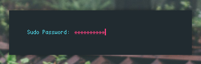|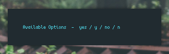||

`Bspwm`

|Password|Message|Confirmation|
|--|--|--|
|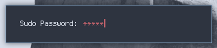|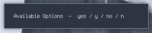|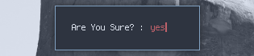|

+ ***Improved Notifications, With Icons***

`Openbox`

|Volume Up|Volume Down|Backlight Up|Backlight Down|Colors|Album Art|
|--|--|--|--|--|--|
||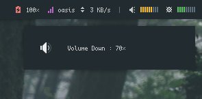||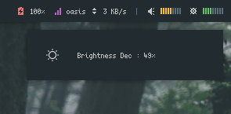|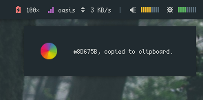||

`Bspwm`

|Volume Up|Volume Down|Backlight Up|Backlight Down|Album Art|
|--|--|--|--|--|
|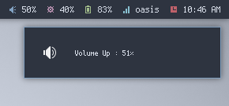|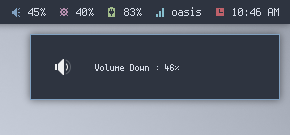|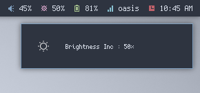|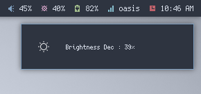|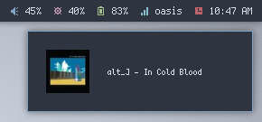|

+ ***New Themes And Styles***

Grub|Plymouth
:--:|:--:
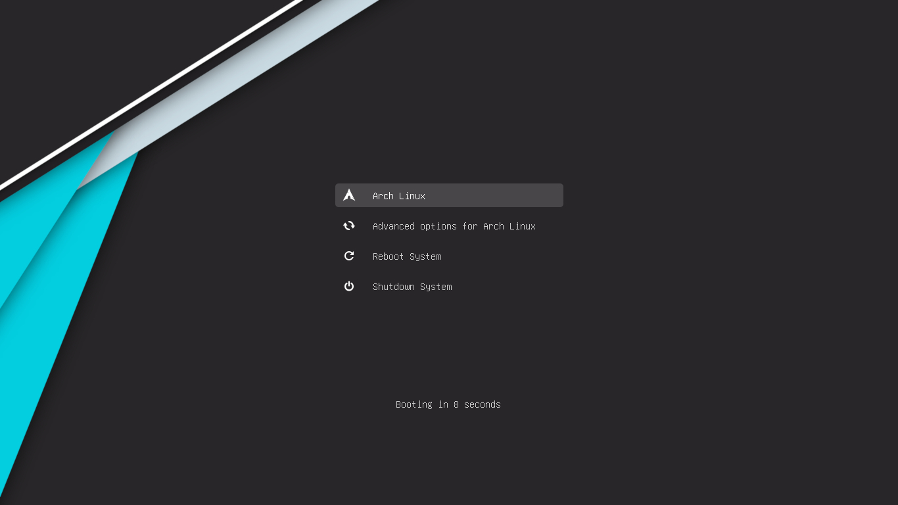|

Lxdm|Better Lockscreen
:--:|:--:
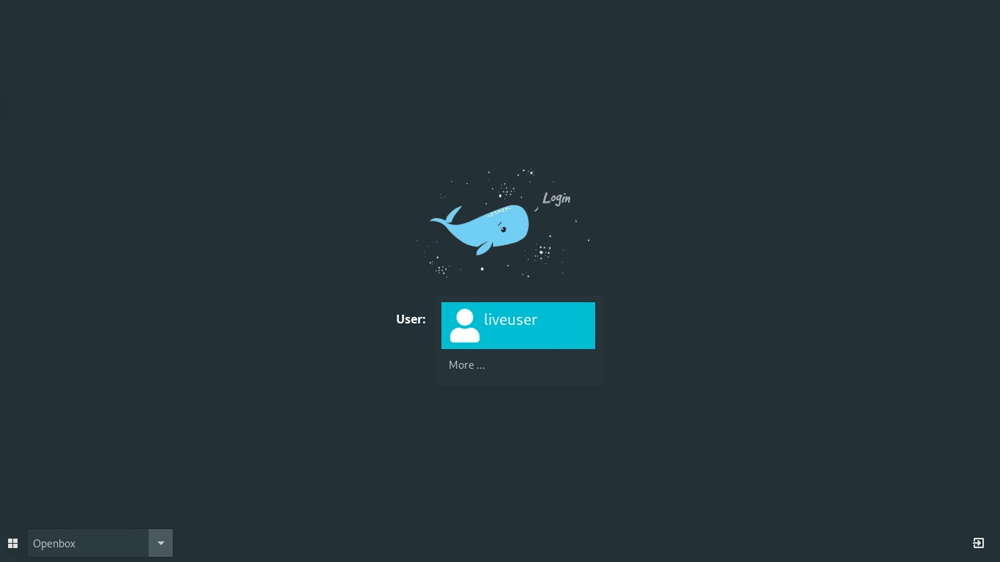|

## Installation

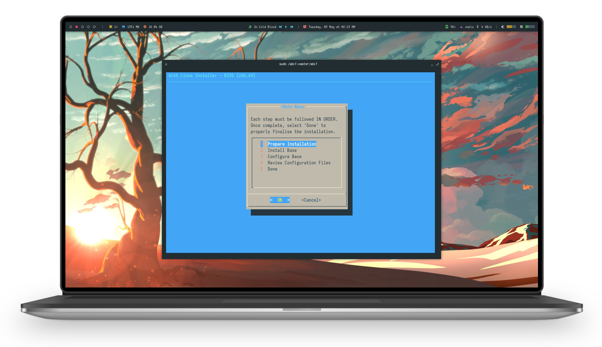 This ISO can be installed, Offline, thanks to [ABIF](https://github.com/adi1090x/archlinux/tree/version-2.0/iso/airootfs/abif-master). I've tested & installed it on a **USB Drive, SDcard, HDD & Virtualbox**, works as expected. Just Don't forget to install *virtualbox guest additions* after installing it on virtualbox.

The installer is very simple and easy to use, but what if you're still a *windows* guy or a *softcore linux user* (Coz arch is for **Hardcore linux users**, Did you get it? NEVERMIND :P). So i've created a step by step guide on how to install it - [Here, How To Install It.](https://github.com/adi1090x/archlinux/blob/master/images/Installer/README.md)
<br />

## Tour

Openbox|Bspwm
:--:|:--:
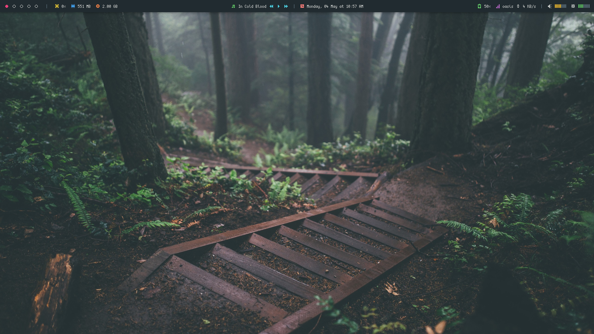|
|[Keybindings & More ...](images/openbox.md)|[Keybindings & More ...](images/bspwm.md)|

### Support This Project
<p align="left">
<a href="https://www.paypal.me/adi1090x" target="_blank"></a>
<a href="https://www.buymeacoffee.com/adi1090x" target="_blank"></a>  
<a href="https://ko-fi.com/adi1090x" target="_blank"></a>  
</p>

## Few Words

+ I'm really bad at *Naming Things*, So Again... i've kept it simple - just ***CustomArch***. 
+ Default `username` and `password` is ***liveuser*** (Live ISO Only).
+ After installing this ISO, run `sudo pacman -Syy` to fix pacman. it'll just download packages database.
+ In this ISO, I've enabled **encryption settings (luks/dm-crypt)** by default. If you're installing it without encryption, there will be no issue, but these settings are useless for you in this case. So after normal installation, comment out `GRUB_ENABLE_CRYPTODISK=y` in */etc/default/grub* and remove `plymouth-encrypt` hook in */etc/mkinitcpio.conf* and rebuilt initrd.
+ **Important -** I've tested it on two laptops, with intel pantium & i3 CPUs. Obviously ISO have intel-video drivers, if you have `nvidia` or something, edit ***packages.x86_64*** and replace the drivers section with your GPU drivers packages, or WM/DE might freeze on startup.
+ You may have to modify some config files according to your system, (i mean that's the goal, right). ***Ex-*** `customiso/airootfs/etc/skel/.config/polybar/modules.ini` for *Battery* & *Network* Modules.
+ By default, touchpad is disabled. To enable it... Open Settings manager & goto `Mouse & Touchpad>Touchpad>Tap to click`.
+ While installing it on the USB, installer seems like it freezed when grub was installing. Problem it - `os-prober` was taking a long time to detect other OS installed on system. it took 10-12 mins to complete. on other media (SDcard & HDD), there was no such issue. Maybe it's a bug related to os-prober, thought i should mention it here. if you face it, pls wait!
+ It's a 64-bit only ISO/OS.
+ ***Updates:*** Well, the best things is, you'll always get the latest Linux kernel, Archlinux System & Packages, if you `build it`. if you can't, Then Install this ISO, run `sudo pacman -Sy archlinux-keyring && sudo pacman -Syu` & DONE, you'll have the latest Arch Linux system.
+ This project is just a derivative of Arch Linux, It's Not [Arch Linux](https://www.archlinux.org) itself.
+ Share this **repo** with your friends/classmates/colleagues who're new to linux/Archlinux.
