<h1 align="center">BSPWM</h1>

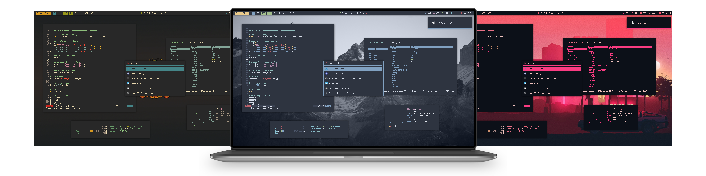

<h3 align="center">Desktop Session</h3>

Desktop|Launcher
:--:|:--:
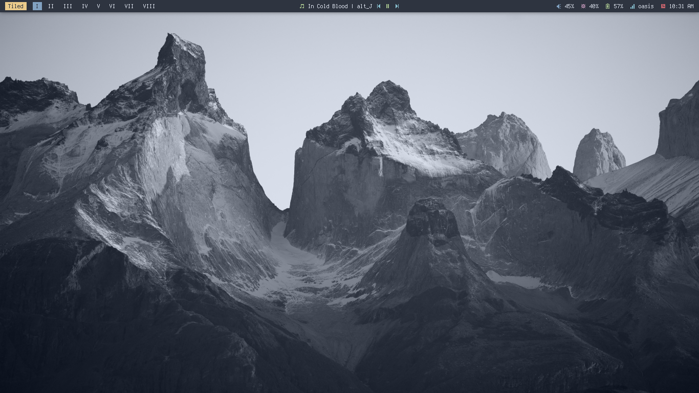|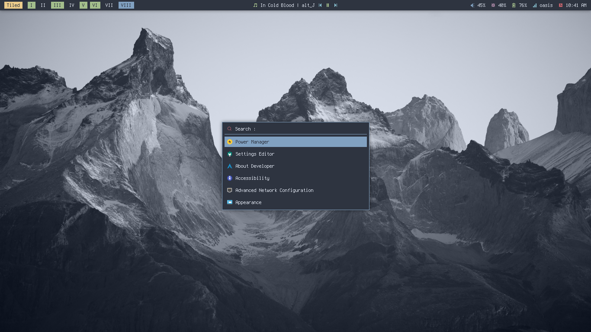

Vim, Ranger, Htop|Tiled
:--:|:--:
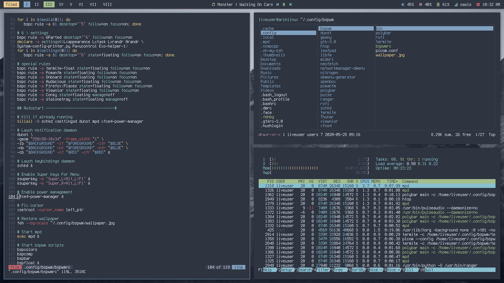|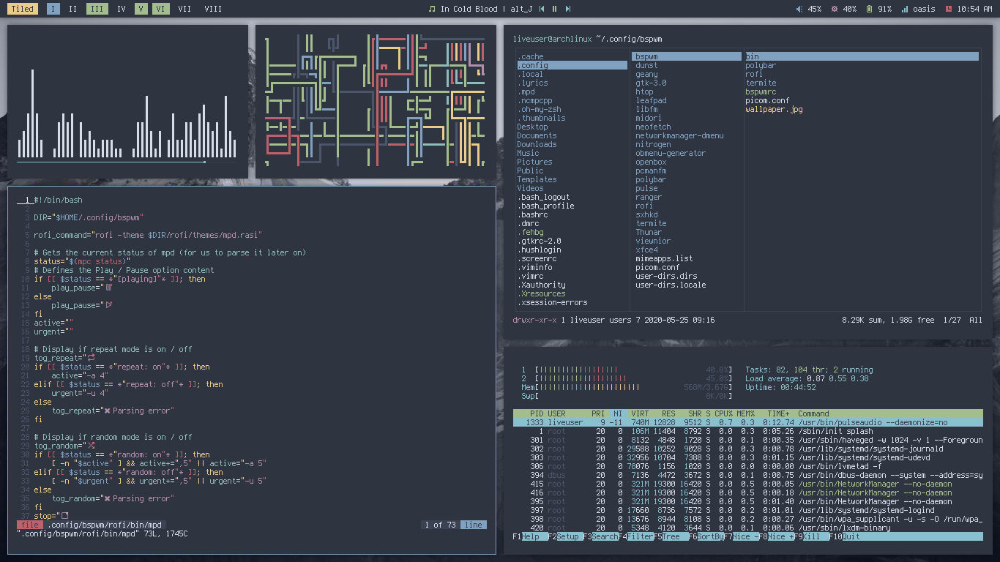

File Manager|Floating
:--:|:--:
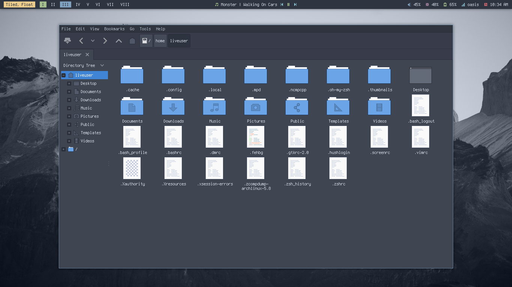|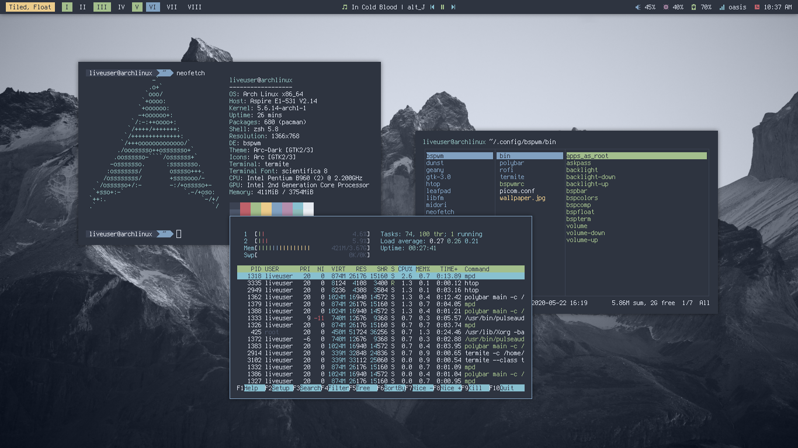

<h3 align="center">Styles</h3>

|Nord|Gruvbox|Groot|
|--|--|--|
|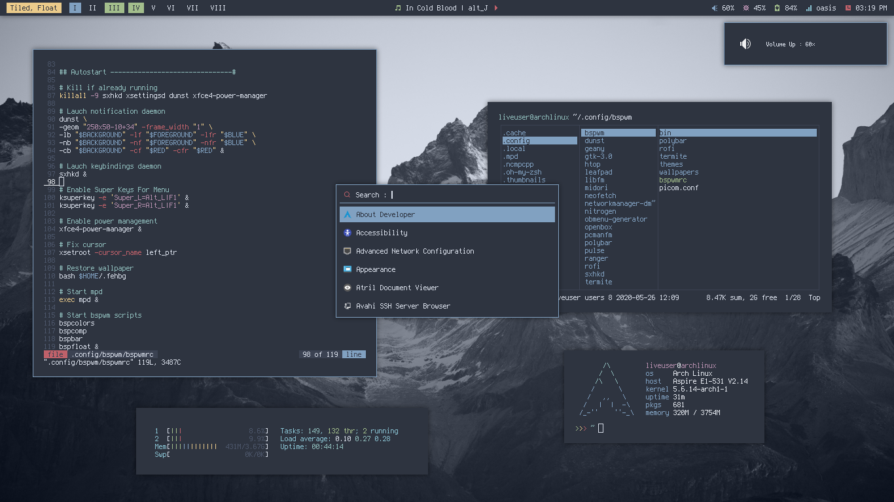|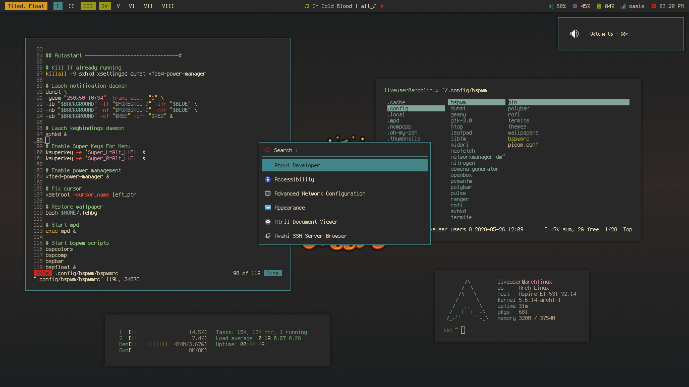|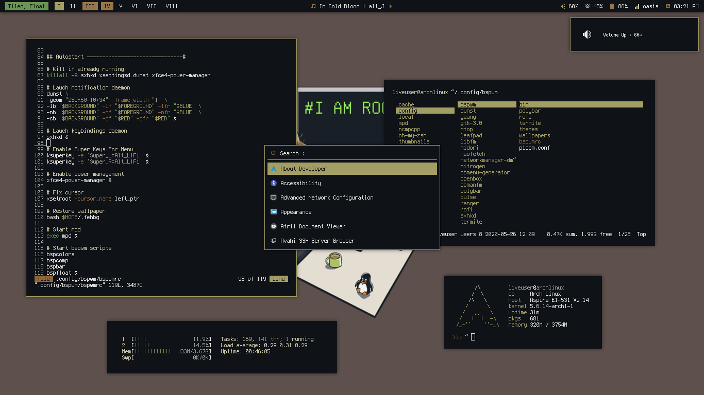|

|Cyberpunk|Rick|Dark|
|--|--|--|
|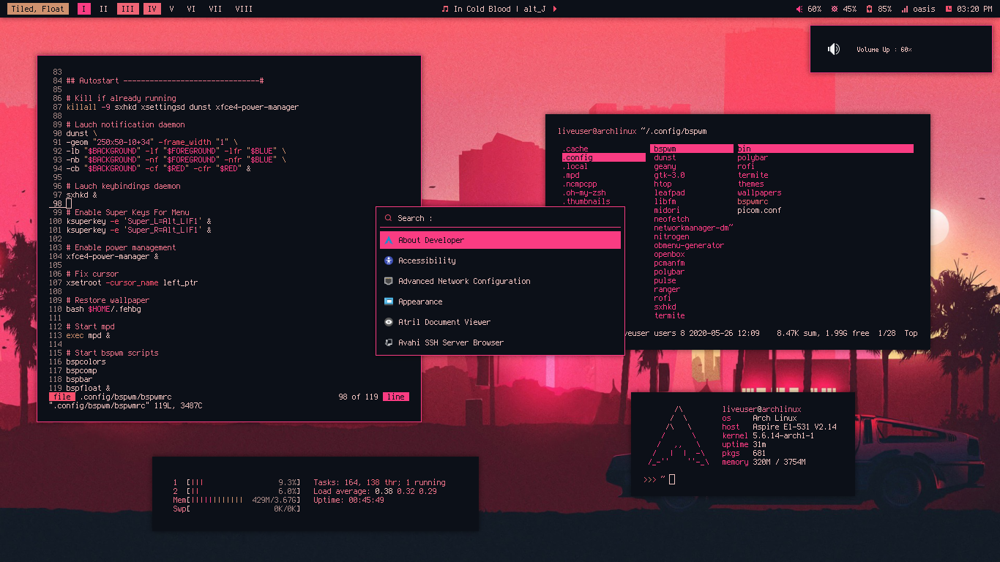|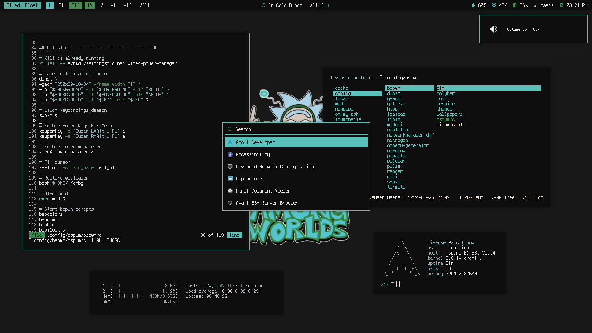|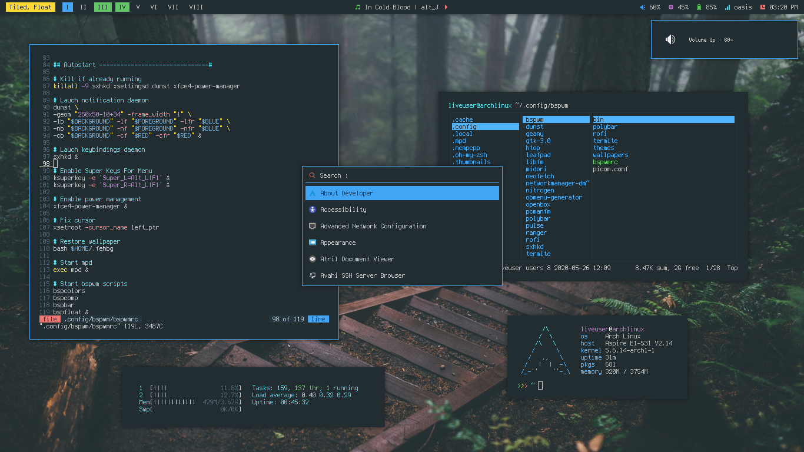|

<h3 align="center">Preselection Mode</h3>

Horizontal|Vertical
:--:|:--:
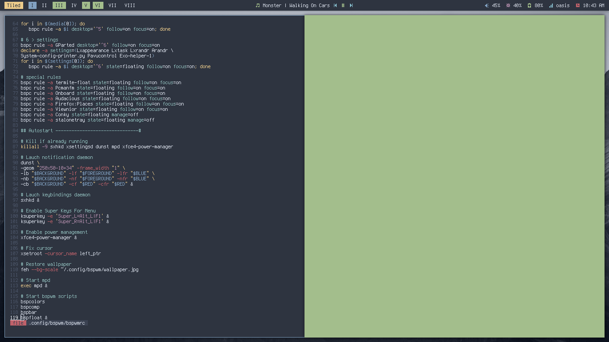|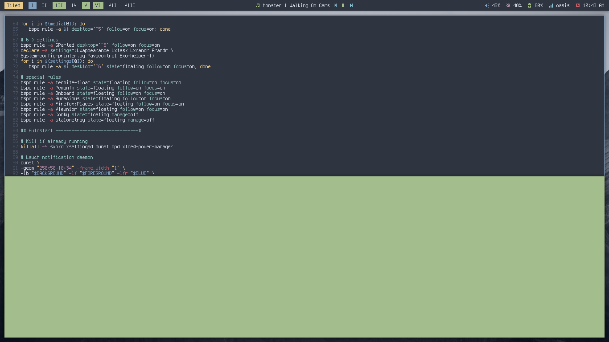

Horizontal Ratio|Vertical Ratio
:--:|:--:
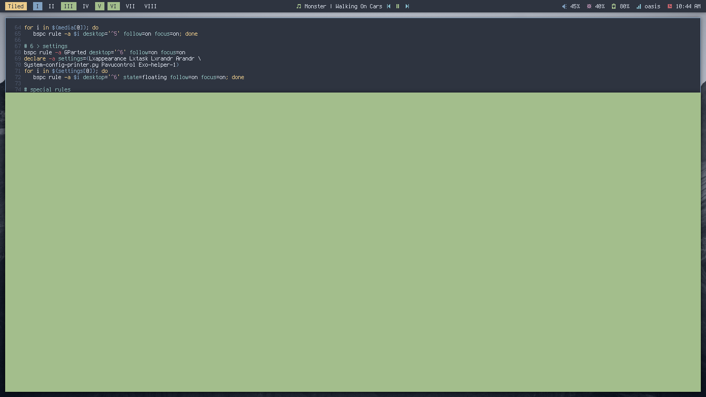|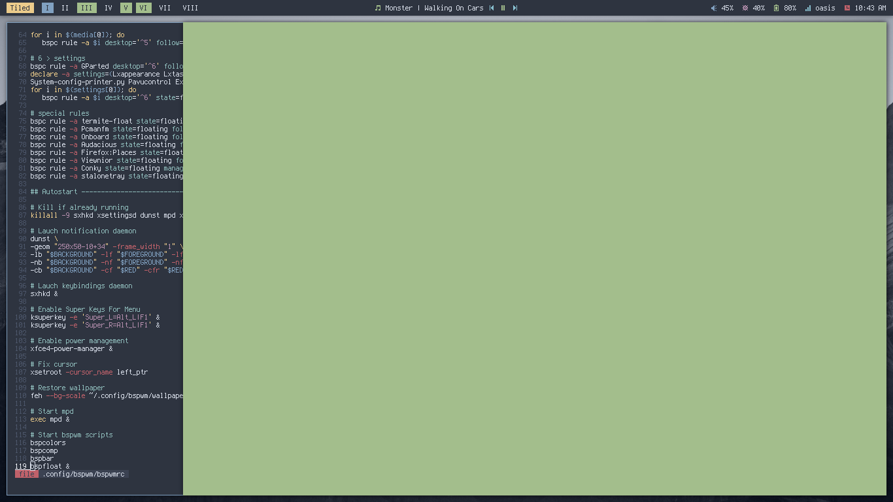

<h3 align="center">Keybinding</h3>

+ **super + Return**  :  Terminal (`termite`)
+ **super + shift + Return**  :  Floating Terminal (`termite`)
+ **alt + F1**  :  Apps Launcher
+ **super + n/w/m/x/r**  :  Network, Windows, Mpd, Powermenu, Apps As Root Menus Respectively
+ **ctrl + alt + s/n/t**  :  Screenshot, Internet, Themes Menus Respectively
+ **super + shift + f/w/g/m/e**  :  Pcmanfm, Firefox, Geany, Midori, Leafpad Respectively

 

+ **Print** : Screenshot
+ **alt + Print** : Screenshot in 5 Seconds
+ **XF86MonBrightness + Up/Down** : Increase/Decrease Brightness
+ **XF86Audio + RaiseVolume/LowerVolume/Mute** : Increase/Decrease/Mute Volume
+ **XF86Audio + Next/Prev/Play/Stop** : Media Control

 

+ **ctrl + alt + l** : Lockscreen
+ **super + Escape** : Reload Keybindings
+ **ctrl + alt + q/r** : Quit/Reload Bspwm
+ **alt + F4** : Close App
+ **super + f** : Monocle
+ **super + h/v/c** : Split horizontal, vertical or cancel
+ **super + ctrl + 1-9** : Preselect the ratio
+ **super + space** : Toggle beetwen floating & tiled
+ **super + p/t** : Pseudo Tiled & tiled mode
+ **super + ctrl + m/x/y/z** : Set the node flags
+ **super + shift + Left/Down/Up/Right** : Send the window to another edge of the screen
+ **alt + shift + Tab** : Change focus to next window, including floating window
+ **ctrl + alt + Left/Right** : Switch workspace
+ **super + Tab** : Switch to last opened workspace
+ **super + shift + 1-8** : Send focused window to another workspace
+ **super + control + Left/Right/Up/Down** : Expanding windows
+ **super + alt + Left/Right/Up/Down** : Shrinking windows
+ **alt + shift + Left/Down/Up/Right** : Move floating windows
