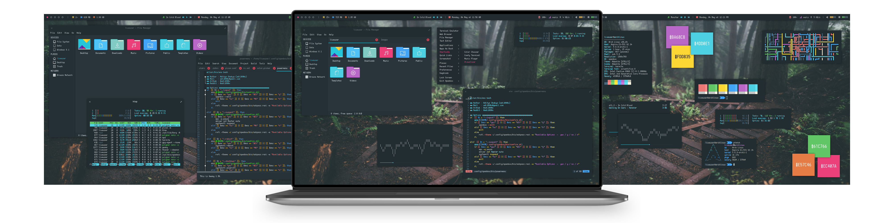

<h1 align="center">OPENBOX</h1>

<h3 align="center">Desktop Session</h3>

Desktop|Openbox Menu
:--:|:--:
|

Launcher|Termite
:--:|:--:
|

Thunar|Geany
:--:|:--:
|

Midori|Apps
:--:|:--:
|

Busy Desktop |Messy Desktop
:--:|:--:
|

<h3 align="center">Modes</h3>

|Default Dark|Default Light|Terminal|Terminal|
|--|--|--|--|
|||||

|Launcher Dark|Launcher Light|Menu Dark|Menu Light|
|--|--|--|--|
|||||

|Applets Dark|Applets Light|Dunst Dark|Dunst Light|
|--|--|--|--|
|||||

<h3 align="center">Tiling</h3>

Tiling 1|Tiling 2
:--:|:--:
|

Tiling 3|Tiling 4
:--:|:--:
|

<h3 align="center">Keybinding</h3>

`Workspaces`

+ **W + 1/2/3/4/5** : Go To Desktop 1/2/3/4/5
+ **W + S + 1/2/3/4/5** : Send To Desktop 1/2/3/4/5
+ **W + S + Left/Right** : Send To Desktop Left/Right

`Windows`

+ **W + Tab** : Next Window (All Desktop)
+ **A + Tab** : Next Window (Current Desktop)
+ **W + Left** : Move To Edge West
+ **W + Right** : Move To Edge Eest
+ **W + Up** : Maximize Full
+ **W + Down** : Unmaximize 60x80
+ **W + h** : Top Left
+ **W + j** : Bottom Left
+ **W + k** : Top Right
+ **W + l** : Bottom Right
+ **W + KP_1** : Bottom Left 50x50
+ **W + KP_7** : Top Left 50x50
+ **W + KP_3** : Bottom Right 50x50
+ **W + KP_9** : Top Right 50x50
+ **W + KP_2** : Bottom 100x50
+ **W + KP_8** : Top 100x50
+ **W + KP_4** : Left 50x100
+ **W + KP_6** : Right 50x100
+ **W + A + Up** : Move Up
+ **W + A + Down** : Move Down
+ **W + A + Left** : Move Left
+ **W + A + Right** : Move Right
+ **C + A + Up** : Resize to Up
+ **C + A + Down** : Resize to Down
+ **C + A + Left** : Resize to Left
+ **C + A + Right** : Resize to Right
+ **A + r** : Toggle Resize
+ **A + m** : Toggle Move
+ **A + F4** : Close Window
+ **A + F5** : Minimize Window
+ **A + F6** : Maximize Window
+ **A + F7** : Toggle Decorations

`System`

+ **XF86AudioRaiseVolume** : Increase Volume
+ **XF86AudioLowerVolume** : Decrease Volume
+ **XF86MonBrightnessUp** : Increase Brightness
+ **XF86MonBrightnessDown** : Decrease Brightness
+ **Print** : Take a screenshot
+ **A + Print** : Take a screenshot in 5 Sec
+ **C + S + Escape** : Exit WM
+ **C + S + BackSpace** : Restart Openbox
+ **C + S + R** : Reconfigure Openbox
+ **W + Escape** : Kill App
+ **W + d** : Show Desktop
+ **W + space** : Root Menu

`Applications`

+ **W + e** : Text Editor `geany`
+ **W + f** : File Manager `thunar`
+ **W + t** : Terminal Emulator `termite`
+ **W + w** : Web Browser `midori`
+ **W + n** : Network Menu
+ **W + m** : MPD Menu
+ **W + x** : Power Menu
+ **W + r** : App Runner
+ **W + s** : Screenshot Menu
+ **W + i** : Internet Menu
+ **W + c** : Colorpicker
+ **Super** : App Launcher
+ **C + A + l** : Lockscreen `betterlockscreen`
+ **C + A + v** : CLI editor `vim`
+ **C + A + r** : CLI File Manager `ranger`
+ **C + A + h** : System Monitor `htop`
